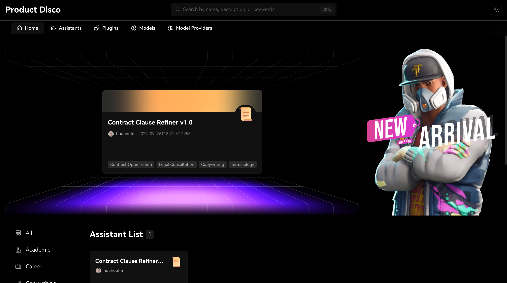

## Tech Stack

- **Framework:** [Next.js](https://nextjs.org)
- **ORM:** [Drizzle ORM](https://orm.drizzle.team)
- **UI Components:** [Ant Design](https://ant.design/)
- **Query tool:** [Hono.js](https://hono.dev/)

## Features/Technique to be implemented

- [x] Have Responsive Design support for Desktop / Tablet / Mobile
- [x] Apply Ant Design
- [x] ORM using **Drizzle ORM**
- [x] Database on **Neon**
- [x] Type safe https comunication
- [x] Storefront with products, categories
- [x] Search products, filter product by categories
- [x] Have custom Hooks ( For Reactjs / Nextjs )
- [x] Separate config into environment file.
- [x] Apply Lazy Load
- [x] Apply Skeleton Load
- [x] Internalization with i18next
- [x] Internalization with i18next
- [x] Have Code Formatter
- [x] Have Code Lint
- [x] Optimize rendering large lists with **React Virtuoso**
- [ ] Authentication/Authorization with **Stripe Checkout**
- [ ] Checkout with **Stripe Checkout**
- [ ] Admin dashboard with stores, products, orders, subscriptions, and payments

## Running Locally

1. Clone the repository

   ```bash
   git clone https://github.com/toan5ks1/nft.git
   ```

2. Install dependencies using pnpm

   ```bash
   pnpm install
   ```

3. Copy the `.env.example` to `.env` and update the variables.

   ```bash
   cp .env.example .env
   ```

4. Start the development server

   ```bash
   pnpm run dev
   ```

5. Push the database schema

   ```bash
   pnpm run db:push
   ```
